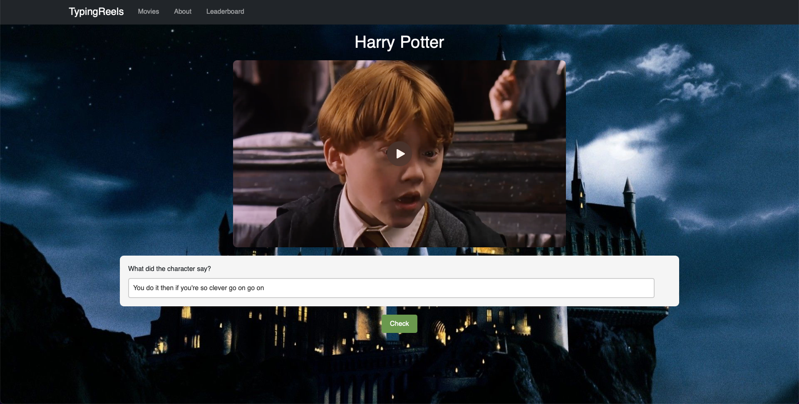
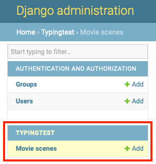
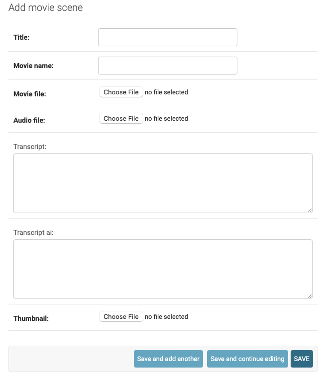
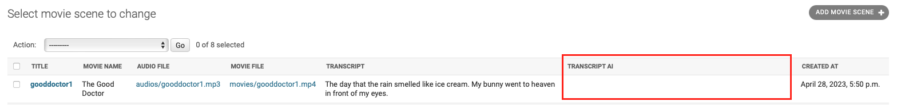

# <b>Typing Reels</b>


Typing Reels is a web application that provides a fun and engaging way to practice your typing and listening skills. The app uses audio and video clips from popular movies to make the experience more enjoyable.

In addition, the app also challenges you with Google's speech-to-text feature, so you can see how well you perform against AI.

<p align="center">
    
</p>


## <b>Getting Started</b>
To use the app, simply navigate to [Typing Reels website](http://34.87.191.196/typingtest), simply click the link. here and select a movie clip that you would like to practice typing along with. Then, start typing the words that you hear from the audio.


## <b>Download Project</b>
Using git to clone project to your computer
``` bash
git clone git@github.com:guyrawit/Typing-Reels.git
```

## <b>Installation</b>
Use the package manager pip to install neccessary python package
```bash 
pip install -r requirements.txt
```

## <b>Cloud Setup</b>
To deploy Typing Reels on the cloud, you need to create a Google Cloud Platform (GCP) project and set up the following services:
### <b>1. Google Cloud Compute Engine</b>
1. Go to the Google Cloud Console and create a new project, or select an existing project.
2. Navigate to the Compute Engine section and create a new instance. Make sure to select a machine type and disk size that are appropriate for your needs.(I'm using e2.micro with 2GB of memory)
### <b>2. Google Cloud SQL (MySQL)</b>
Typing Reels requires a MySQL database to store user data and movie clips. You can create a Cloud SQL instance by following these steps:
1. Open the Cloud SQL instances page in the GCP Console.
2. Click "Create instance" and choose "MySQL".
3. Choose the desired instance ID, region, and zone.
4. Choose a machine type and storage capacity.(I've used 1vCPUs 3.75 GB for memory and 20 GB for storage)
5. Set a root password and choose a database version.
6. Click "Create" to create the instance.
### <b>3. Google Cloud SQL (MySQL)</b>
Typing Reels uses Google Cloud Storage to store movie clips. You can create a bucket by following these steps:
1. Open the Google Cloud Storage page in the GCP Console.
2. Click "Create bucket".
3. Choose a globally unique bucket name and a storage class.
4. Choose a default location and a default storage class.
5. Click "Create" to create the bucket.

### <b>4. Google Cloud Credentials</b>
Typing Reels needs access to your GCP project to use Cloud SQL and Cloud Storage. To grant access, you need to create a service account and download a JSON key file:
1. Open the IAM & admin > Service accounts page in the GCP Console.
2. Click "Create service account".
3. Enter a service account name and description.
4. Click "Create" to create the service account.
5. Click "Add Key" and choose "JSON".
Save the downloaded JSON file to your local machine.

### <b>5. Google Cloud Speech-to-Text</b>
Typing Reels uses Google Cloud Speech-to-Text to generate transcripts of the movie clips. Here's how to set up the service:
1. Make sure you have a Google Cloud project set up (see previous section).
2. Enable the Cloud Speech-to-Text API in your project.

## <b>Configuration</b>
After creating the required services, you need to configure Typing Reels to use them:

1. Open the `"typingpractice/typingpractice/settings.py"` file in your project directory.
2. Set the `"DATABASES"` dictionary to point to your Cloud SQL instance.
3. Set the `"GS_CREDENTIALS"` variable to the path of your downloaded JSON key file.
4. Set the `"GS_BUCKET_NAME"` variable to the name of your Cloud Storage bucket.
``` python
# typingpractice/typingpractice/settings.py

DATABASES = {
    "default": {
        "ENGINE": "django.db.backends.mysql",
        "NAME": "Enter your database name",
        "USER": "Enter your mysql username",
        "PASSWORD": "Enter your mysql password",
        "HOST": "Enter your mysql hostname(IP address)",
        "PORT": "3306"
    }
}

GS_CREDENTIALS = service_account.Credentials.from_service_account_file(
    "Enter your google cloud credential path here(JSON)"
)

GS_BUCKET_NAME = "Enter you google bucket name"
```
## <b>Upload videos to google cloud storage</b>
Before uploding videos to google cloud storage you need to create superuser account(admin account). You can do this by running the following command on your terminal
``` bash
python manage.py createsuperuser
```
Then, follow the prompts to create a superuser account with a username email and password. Once you have created a superuser account, you can log in to the Django admin site and follow next step.

Before you can log in to the Django admin site at http://localhost:8000/admin and upload movies to the server and their metadata to SQL server, you need to make sure that the Django server is running. You can do this by running the following command on your terminal:
``` bash
python manage.py runserver 8000
```

To upload movies to the server and their metadata to SQL, you can go to the Django admin site at http://localhost/admin and log in with your superuser account you just created. Then, follow these steps:
1. Click on "Add" button under the "TYPINGTEST" section.

<p align="center">
    
</p>

2. Fill in the form with the metadata for the movie clip, including the title, file, and any other relevant information.
<p align="center">
    
</p>

4. Click the "Save" button to upload the movie clip and its metadata to the google cloud bucket and google cloud SQL server.

## <b>Generating Transcripts with Google Cloud Speech-to-Text</b>
Typing Reels uses Google Cloud Speech-to-Text to generate transcripts of the movie clips. When you uploads a video and fills out the form, the transcript_ai column is left blank. To generate a transcript using Google Cloud Speech-to-Text, follow these steps:
<p align="center">
    
</p>

1. Log in to the Django admin site at http://localhost:8000/admin with your superuser credentials.
2. Click on "Movie clips" under the "Typingapp" section.
3. Select the video for which you want to generate a transcript by clicking on its checkbox.
4. Click the "Action" dropdown button and select "Generate transcript with AI".
5. Wait for the transcript to be generated. The process may take some time depending on the length of the video.
6. Refresh the page and the transcript_ai column for the selected video should now be populated with the generated transcript.

